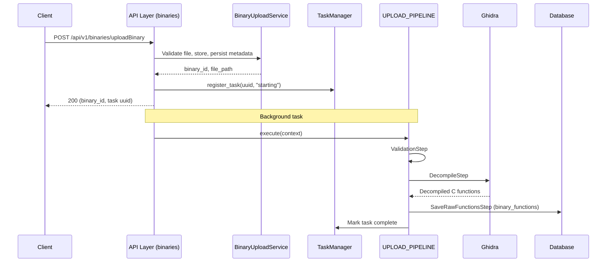
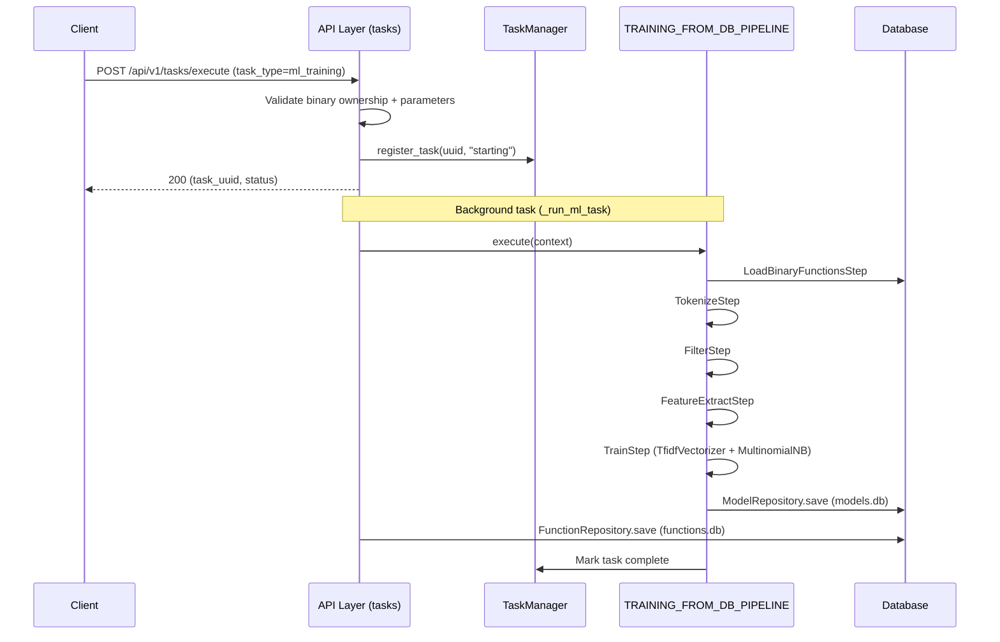
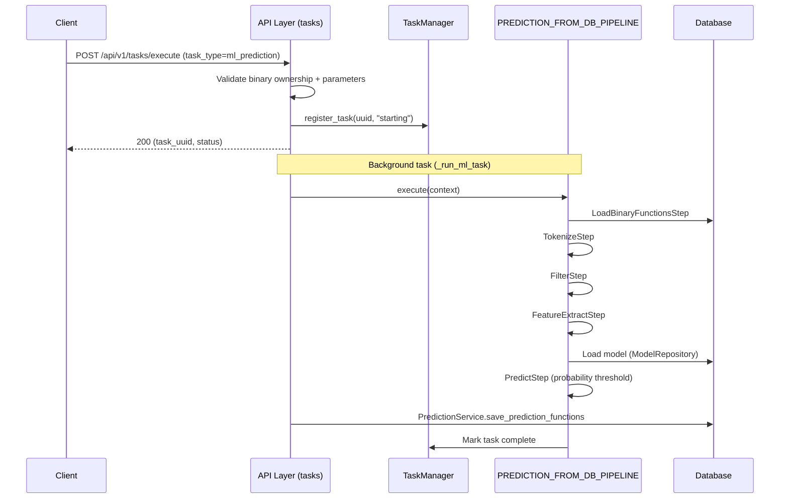

# Glyph Architecture Documentation

## Overview

Glyph is an architecture-independent binary analysis tool that uses NLP techniques for function fingerprinting across different system architectures. The application is built with FastAPI, uses async SQLite (via aiosqlite + SQLAlchemy ORM) for persistence, and integrates with Ghidra (via PyGhidra Java interop) for binary decompilation. It includes a full authentication system with JWT tokens (OAuth2 password-bearer flow), API key management, and optional LLM-based analysis of dangerous-function findings.

## System Architecture

```
┌─────────────────────────────────────────────────────────────────────────────┐
│                            Presentation Layer                                │
│  ┌──────────────────────┐  ┌──────────────────────┐  ┌───────────────────┐  │
│  │   Web UI (Jinja2)    │  │   API (FastAPI/REST) │  │  Auth Endpoints   │  │
│  │   (HTML/CSS/JS)      │  │   (JSON Responses)   │  │  (JWT Bearer)     │  │
│  └──────────────────────┘  └──────────────────────┘  └───────────────────┘  │
└─────────────────────────────────────────────────────────────────────────────┘
                                       │
                                       ▼
┌─────────────────────────────────────────────────────────────────────────────┐
│                            Application Layer                                 │
│  ┌──────────────────────┐  ┌──────────────────────┐  ┌───────────────────┐  │
│  │  Request Handler     │  │  Task Service        │  │  Auth Service     │  │
│  │  (Business Logic)    │  │  (Task Queue)        │  │  (JWT/API Keys)   │  │
│  └──────────────────────┘  └──────────────────────┘  └───────────────────┘  │
└─────────────────────────────────────────────────────────────────────────────┘
                                       │
                                       ▼
┌─────────────────────────────────────────────────────────────────────────────┐
│                            Processing Layer                                  │
│  ┌──────────────────────┐  ┌─────────────────────────────────────────────┐  │
│  │  Task Management     │  │  Processing Pipeline                        │  │
│  │  (TaskManager/       │  │  (Upload: Validate → Decompile → Save Raw)  │  │
│  │  EventWatcher)       │  │  (ML: Load → Tokenize → Filter → Extract →  │  │
│  │  Ghidra Integration) │  │   Train/Predict)                            │  │
│  └──────────────────────┘  └─────────────────────────────────────────────┘  │
└─────────────────────────────────────────────────────────────────────────────┘
                                       │
                                       ▼
┌─────────────────────────────────────────────────────────────────────────────┐
│                              Data Layer                                      │
│  ┌──────────────────────┐  ┌─────────────────────────────────────────────┐  │
│  │  SQLAlchemy ORM      │  │  Repositories (User, APIKey, Binary,        │  │
│  │  (Async Models)      │  │  Function, Model, Prediction, Similarity,   │  │
│  │  (Session Mgmt)      │  │  LLM Result, LLM Config, Scan Report)       │  │
│  └──────────────────────┘  └─────────────────────────────────────────────┘  │
│                                      │                                       │
│                    ┌─────────────────┴─────────────────┐                     │
│                    ▼                                   ▼                     │
│          ┌─────────────────┐ ┌─────────────────────────────────┐            │
│          │   models.db     │ │ predictions.db                  │            │
│          │   functions.db  │ │ binaries.db                     │            │
│          │   auth.db       │ │ intelligence.db                 │            │
│          └─────────────────┘ └─────────────────────────────────┘            │
└─────────────────────────────────────────────────────────────────────────────┘
```

## Core Components

### API Layer (`app/api/`)

- **`router.py`** - Centralized API router; mounts the v1 sub-routers (`/binaries`, `/predictions`, `/models`, `/status`, `/config`, `/dangerous-functions`, `/call-graph`, `/tasks`)
- **`types.py`** - Shared API type definitions
- **`v1/endpoints/`** - Version 1 API endpoints:
  - `binaries.py` - Binary upload, bulk upload, listing, detail, functions, and deletion
  - `predictions.py` - Prediction execution (`/predict`), listing, detail, and deletion
  - `models.py` - Model management (deletion, function retrieval, prediction details)
  - `status.py` - Task status checking, status updates, and SSE status streaming
  - `config.py` - Configuration save and LLM endpoint test endpoints
  - `dangerous_functions.py` - Dangerous function scanning, scan/LLM result management, and catalog browsing
  - `call_graph.py` - Call graph generation (graph, callers, callees per function)
  - `tasks.py` - Task execution (dispatches code reuse, dangerous functions, similarity, and ML training/prediction), results, status, and similarity computation management

### Authentication Layer (`app/auth/`)

- **`jwt_handler.py`** - JWT token generation and verification (HS256)
- **`dependencies.py`** - FastAPI dependency injection for authentication (OAuth2 password-bearer token flow)
- **`endpoints.py`** - Authentication API endpoints under `/auth`: register, token, refresh, logout, current user, password change, profile update, and API key management
- **`schemas.py`** - Pydantic schemas for authentication data
- **`security_logger.py`** - Security event logging and IP blocking

### Web Layer (`app/web/`)

- **`endpoints/web.py`** - Web UI endpoints with HTML responses (home, stats, config, models, predictions, binaries, tasks, profile, login/register, error pages)
- **`templates/`** (project root) - Jinja2 templates, served via the shared `Jinja2Templates` instance in `app/templates.py`
- **`static/`** (project root) - Static assets (CSS, JavaScript), mounted at `/static` with cache headers via `CachedStaticFiles` in `main.py`

### Core Services (`app/core/`)

- **`lifespan.py`** - Application lifespan events: configuration validation, async database initialization, background task service startup, and event watcher lifecycle
- **`rate_limiter.py`** - Rate limiting (via slowapi) for login, registration, password changes, token refresh, and LLM analysis (environment-overridable limits)
- **`correlation_bridge.py`** - Bridges `asgi-correlation-id` middleware (`X-Request-ID` header) into the Glyph request context

### Services Layer (`app/services/`)

- **`request_handler.py`** - Business logic for processing requests (`DataHandler`, `TrainingRequest`, `PredictionRequest`, `Prediction`)
- **`binary_upload_service.py`** - Binary file validation, storage, and metadata operations
- **`prediction_service.py`** - Prediction result persistence, retrieval, and deletion
- **`binary_similarity_service.py`** - Binary similarity computation with result persistence and caching
- **`code_reuse_detector.py`** - Code reuse detection via token-level analysis (Jaccard similarity + LCS ratio)
- **`call_graph_service.py`** - Call graph generation for binaries
- **`dangerous_function_scanner.py`** - Dangerous function scanning with call-site context
- **`dangerous_functions_catalog.py`** - Catalog of dangerous/insecure C library functions
- **`llm_analysis_service.py`** - LLM analysis of dangerous-function findings via an OpenAI-compatible chat completions endpoint

### Database Layer (`app/database/`)

- **`models.py`** - SQLAlchemy ORM models (async via aiosqlite, plain `DeclarativeBase`):
  - `Model` - Trained ML models (encoder + pipeline serialized via joblib)
  - `Prediction` - Prediction tasks
  - `Function` - Extracted functions
  - `Binary` - Uploaded binaries
  - `BinaryFunction` - Raw decompiled functions per binary
  - `User` - User accounts (authentication)
  - `APIKey` - API keys for programmatic access
  - `LLMUserConfig` - Per-user LLM endpoint configuration
  - `SimilarityComputation` - Saved similarity computation tasks
  - `SimilarityPair` - Pairwise similarity results
  - `LLMAnalysisResult` - Stored LLM analyses of dangerous-function findings
  - `ScanReport` - Stored dangerous function scan reports
- **`session_handler.py`** - Async database session management (six per-purpose engines, WAL mode)
- **`repository.py`** - `UserRepository` (Argon2id password hashing) and `APIKeyRepository` (bcrypt key hashing)
- **`binary_repository.py`** - Repository for `Binary`/`BinaryFunction` operations
- **`function_repository.py`** - Repository for `Function` operations
- **`model_repository.py`** - Repository for `Model` operations (save/load joblib-serialized models)
- **`prediction_repository.py`** - Repository for `Prediction` operations
- **`llm_result_repository.py`** - Repository for `LLMAnalysisResult` operations
- **`llm_user_config_repository.py`** - Repository for `LLMUserConfig` operations
- **`scan_report_repository.py`** - Repository for `ScanReport` operations
- **`similarity_repository.py`** - Repository for `SimilarityComputation`/`SimilarityPair` operations

### Processing Layer (`app/processing/`)

- **`pipeline.py`** - Pluggable processing pipeline: `PipelineContext`, `PipelineStep` (ABC), and `ProcessingPipeline` orchestrator
- **`steps.py`** - Pipeline step implementations:
  - `ValidationStep` - Binary file validation (existence, readability, size limits)
  - `DecompileStep` - Ghidra decompilation (via PyGhidra)
  - `TokenizeStep` - Code tokenization from decompiled functions
  - `FilterStep` - Token filtering (normalize addresses, functions, variables, remove comments)
  - `FeatureExtractStep` - Feature extraction (token sequences for the ML pipeline)
  - `TrainStep` - Model training (scikit-learn pipeline: TfidfVectorizer + MultinomialNB)
  - `PredictStep` - Model prediction with probability-threshold filtering
  - `SaveRawFunctionsStep` - Persists raw decompiled functions to the `binary_functions` table
  - `LoadBinaryFunctionsStep` - Loads previously stored functions from the database
- **`pipeline_configs.py`** - Predefined pipeline compositions: `UPLOAD_PIPELINE`, `ML_PREDICTION_ONLY_PIPELINE`, `TRAINING_FROM_DB_PIPELINE`, `PREDICTION_FROM_DB_PIPELINE`
- **`task_management.py`** - Task execution management: `TaskManager` (singleton with process pool executor) and `EventWatcher` (future completion callbacks)
- **`ghidra_processor.py`** - Ghidra decompilation integration via PyGhidra (Java interop)

### Utilities (`app/utils/`)

- **`background_tasks.py`** - Fire-and-forget background asyncio task helpers (GC protection, delayed cleanup)
- **`common.py`** - Code formatting and response building utilities
- **`helpers.py`** - Common constants and helper values
- **`logging_config.py`** - Loguru logging setup
- **`logging_utils.py`** - Logging decorators and utilities
- **`request_context.py`** - Async-safe request context capture/restore for background tasks
- **`responses.py`** - Standardized API response models (success/error envelopes)
- **`secure_deserializer.py`** - Allowlist-based secure pickle/joblib deserialization

### Configuration (`app/config/`)

- **`settings.py`** - Pydantic-based configuration management (YAML + environment variables):
  - `GlyphSettings` - Main settings class with YAML config source (`config.yml`), exposed via the `get_settings()` singleton
- **`pipeline_configs.py`** - ML pipeline factory (`MLTask.get_multi_class_pipeline`): `TfidfVectorizer` (n-grams 2–4, sublinear TF) + `MultinomialNB`

## Data Flow

Binary analysis is two-phase: an **upload phase** decompiles the binary and stores raw functions, then a **task phase** runs ML training/prediction (or other analyses) over the stored functions.

### Binary Upload Pipeline

```
1. Upload Binary → 2. Validate → 3. Decompile (Ghidra) → 4. Save Raw Functions
```

#### Binary Upload Sequence Diagram



### Training Pipeline

```
1. Execute Task → 2. Load Functions (DB) → 3. Tokenize → 4. Filter →
5. Extract Features → 6. Train Model → 7. Save Model (DB)
```

#### Training Pipeline Sequence Diagram



### Prediction Pipeline

```
1. Execute Task → 2. Load Functions (DB) → 3. Tokenize → 4. Filter →
5. Extract Features → 6. Load Model (DB) → 7. Predict → 8. Save Predictions (DB)
```

#### Prediction Pipeline Sequence Diagram



## Database Schema

Six per-purpose SQLite databases (under `data/`, overridable via `GLYPH_DATA_DIR`):

| Database | Tables | Purpose |
|----------|--------|---------|
| `models.db` | `models` | Stores trained ML models (encoder + pipeline serialized via joblib) |
| `predictions.db` | `predictions` | Stores prediction tasks and results |
| `functions.db` | `functions` | Stores extracted functions per model |
| `auth.db` | `users`, `api_keys`, `llm_user_configs` | Authentication, API key management, per-user LLM configuration |
| `binaries.db` | `binaries`, `binary_functions` | Uploaded binaries and raw decompiled functions |
| `intelligence.db` | `similarity_computations`, `similarity_pairs`, `llm_analysis_results`, `scan_reports` | Similarity computations, LLM analysis results, and scan reports |

## Technology Stack

| Component | Technology |
|-----------|------------|
| Web Framework | FastAPI (uvicorn) |
| Database | SQLite (async via aiosqlite + SQLAlchemy ORM) |
| Template Engine | Jinja2 |
| ML Framework | scikit-learn (TfidfVectorizer + MultinomialNB) |
| Binary Analysis | Ghidra (via PyGhidra Java interop) |
| Serialization | joblib |
| Configuration | Pydantic Settings (YAML + env vars) |
| Authentication | JWT (HS256) via OAuth2 password-bearer flow, Argon2id password hashing |
| API Key Security | bcrypt |
| Rate Limiting | slowapi |
| LLM Analysis | OpenAI-compatible chat completions (optional, per-user) |
| Logging | loguru |

## Key Design Patterns

1. **Repository Pattern** - Abstracts database operations (UserRepository, APIKeyRepository, BinaryRepository, FunctionRepository, ModelRepository, PredictionRepository, and intelligence repositories)
2. **Pipeline Pattern** - Pluggable, sequential processing steps via the `PipelineStep` interface, composed into named pipelines in `pipeline_configs.py`
3. **Singleton Pattern** - Settings (`get_settings`), `TaskManager`, `TaskService`
4. **Factory Pattern** - Response creation utilities and the ML pipeline factory (`MLTask`)
5. **Middleware Composition** - Layered ASGI middleware (GZip, request size limit, correlation ID, CSP, CORS) registered in the app factory (`main.py`)
6. **Dependency Injection** - FastAPI dependencies for authentication and database sessions
