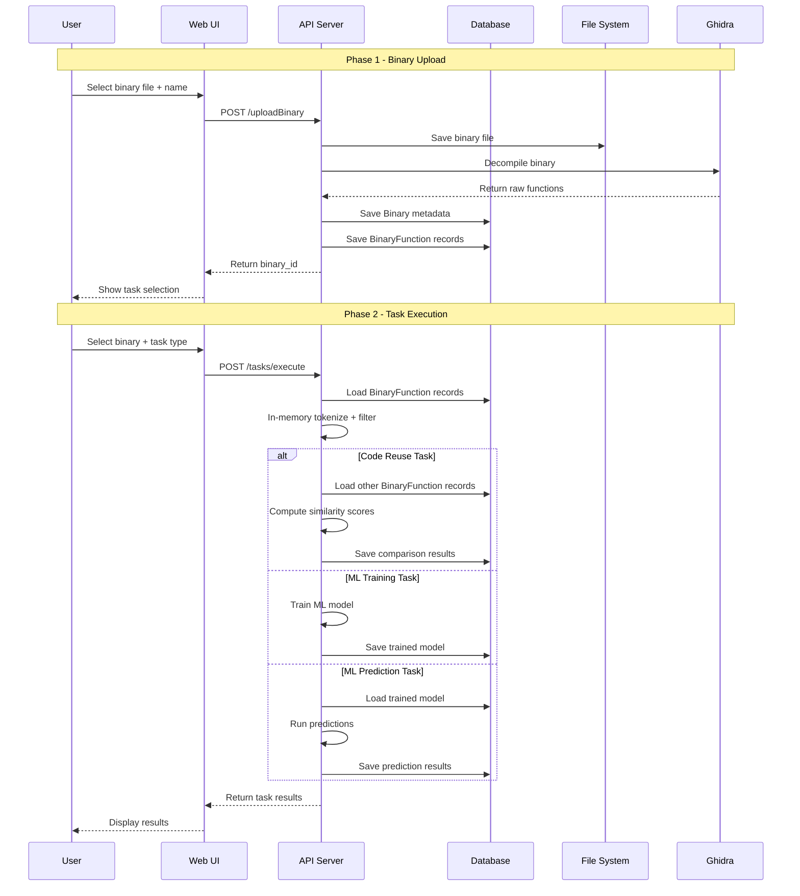

# Binary Upload & Task Selection Architecture Redesign

## Overview

This document outlines the architectural changes required to decouple binary upload from task execution. Currently, uploading a binary immediately triggers ML training or prediction. The new design separates these concerns:

1. **Upload Phase**: Binary is uploaded, decompiled, and raw functions are stored in the database without any modification.
2. **Task Phase**: User selects an existing binary and chooses a task (Code Reuse Detection, ML Training, or ML Prediction). Filtering, tokenization, and other modifications occur only in memory during task execution.

## Core Design Principles

- **Raw Storage**: Database stores unmodified decompiled C code functions
- **In-Memory Processing**: All filtering, normalization, and tokenization happen only when a task is executed
- **Binary Independence**: Binaries exist independently of models, predictions, or tasks
- **Reusable Binaries**: One binary can be used across multiple tasks without re-uploading

---

## 1. Database Schema Changes

### 1.1 New `Binary` Model

Stores metadata about each uploaded binary.

```python
class Binary(Base):
    """Model representing an uploaded binary in the database.
    
    Attributes:
        id: Primary key (auto-increment integer)
        name: Human-readable name given by the user at upload time
        file_path: Path to the binary file on disk
        file_size: Size in bytes (for validation and display)
        mime_type: Detected MIME type of the binary
        uploaded_by: Foreign key to User.id (who uploaded it)
        created_at: Timestamp when the binary was uploaded
        modified_at: Timestamp when the binary was last modified
    """
    __tablename__ = "binaries"
    
    id: Mapped[int] = mapped_column(Integer, primary_key=True, autoincrement=True)
    name: Mapped[str] = mapped_column(String(256), nullable=False)
    file_path: Mapped[str] = mapped_column(String(512), nullable=False)
    file_size: Mapped[int] = mapped_column(Integer, nullable=False)
    mime_type: Mapped[str] = mapped_column(String(64), nullable=False)
    uploaded_by: Mapped[int] = mapped_column(ForeignKey("users.id"), nullable=False)
    created_at: Mapped[datetime] = mapped_column(DateTime, default=get_utc_now, nullable=False)
    modified_at: Mapped[datetime] = mapped_column(DateTime, default=get_utc_now, onupdate=get_utc_now, nullable=False)
```

### 1.2 New `BinaryFunction` Model

Stores raw decompiled C code for each function extracted from a binary. No tokenization, filtering, or normalization is applied.

```python
class BinaryFunction(Base):
    """Model representing a raw decompiled function from a binary.
    
    Attributes:
        id: Primary key (auto-increment integer)
        binary_id: Foreign key to Binary.id
        function_name: Name of the function (e.g., "FUN_00401000" or user-renamed)
        entrypoint: Memory address/entry point of the function
        raw_code: Raw decompiled C code as text (unmodified Ghidra output)
        created_at: Timestamp when the function was extracted
        modified_at: Timestamp when the function was last modified
    """
    __tablename__ = "binary_functions"
    
    id: Mapped[int] = mapped_column(Integer, primary_key=True, autoincrement=True)
    binary_id: Mapped[int] = mapped_column(ForeignKey("binaries.id"), nullable=False, index=True)
    function_name: Mapped[str] = mapped_column(String(256), nullable=False)
    entrypoint: Mapped[str] = mapped_column(String(16), nullable=False)
    raw_code: Mapped[str] = mapped_column(Text, nullable=False)
    created_at: Mapped[datetime] = mapped_column(DateTime, default=get_utc_now, nullable=False)
    modified_at: Mapped[datetime] = mapped_column(DateTime, default=get_utc_now, onupdate=get_utc_now, nullable=False)

    __table_args__ = (
        UniqueConstraint("binary_id", "function_name", name="uq_binary_functions_binary_name"),
    )
```

### 1.3 New Database: `binaries.db`

Add a new SQLite database for binary data, separate from existing databases:

| Database | Purpose |
|----------|---------|
| `models.db` | Trained ML models (unchanged) |
| `predictions.db` | Prediction results (unchanged) |
| `functions.db` | Function data associated with models/predictions (unchanged) |
| `auth.db` | User authentication (unchanged) |
| `binaries.db` | **NEW** - Binaries and their raw decompiled functions |

### 1.4 Session Handler Update

In [`app/database/session_handler.py`](app/database/session_handler.py):

```python
_DEFAULT_ASYNC_DATABASE_URLS: dict[str, str] = {
    "models": "sqlite+aiosqlite:///data/models.db",
    "predictions": "sqlite+aiosqlite:///data/predictions.db",
    "functions": "sqlite+aiosqlite:///data/functions.db",
    "auth": "sqlite+aiosqlite:///data/auth.db",
    "binaries": "sqlite+aiosqlite:///data/binaries.db",  # NEW
}

DB_TABLE_MAP: dict[str, list[Any]] = {
    "models": [Model.__table__],
    "predictions": [Prediction.__table__],
    "functions": [Function.__table__],
    "auth": [User.__table__, APIKey.__table__],
    "binaries": [Binary.__table__, BinaryFunction.__table__],  # NEW
}
```

---

## 2. API Endpoint Changes

### 2.1 Modified Binary Upload Endpoint

**Endpoint:** `POST /api/v1/binaries/uploadBinary`

**Current Behavior:**
- Accepts binary file + ML parameters (model_name, ml_class_type, training_data)
- Immediately runs full pipeline (decompile -> tokenize -> filter -> train/predict)
- Saves filtered functions to database

**New Behavior:**
- Accepts binary file + only a `name` field
- Runs only: Validation -> Decompile -> Save raw functions
- Returns binary ID for later task selection
- No ML processing at upload time

**Request Schema:**
```python
class BinaryUploadForm(BaseModel):
    name: str = Field(..., min_length=1, max_length=256)
```

**Response Schema:**
```python
class BinaryUploadResponse(BaseModel):
    binary_id: int
    name: str
    function_count: int
    uuid: str  # Task UUID for progress tracking
```

### 2.2 New Binary Listing Endpoint

**Endpoint:** `GET /api/v1/binaries/list`

Returns list of all binaries for the current user with metadata.

**Response:**
```json
{
  "success": true,
  "data": {
    "binaries": [
      {
        "id": 1,
        "name": "malware_sample_01",
        "file_size": 524288,
        "function_count": 42,
        "mime_type": "application/x-dosexec",
        "created_at": "2026-06-16T12:00:00Z"
      }
    ]
  }
}
```

### 2.3 New Binary Detail Endpoint

**Endpoint:** `GET /api/v1/binaries/{binary_id}`

Returns full binary metadata and function list.

### 2.4 New Task Execution Endpoint

**Endpoint:** `POST /api/v1/tasks/execute`

Accepts a binary ID and task type, executes the corresponding pipeline in the background.

**Request Schema:**
```python
class TaskExecutionRequest(BaseModel):
    binary_id: int
    task_type: TaskType  # Enum: "code_reuse", "ml_training", "ml_prediction"
    task_name: str = Field(..., min_length=1)
    # Optional task-specific parameters
    model_name: str | None = None       # Required for ml_training and ml_prediction
    ml_class_type: str | None = None    # Required for ml_training
```

**Response:**
```json
{
  "success": true,
  "data": {
    "task_uuid": "abc-123",
    "task_type": "code_reuse",
    "binary_id": 1,
    "status": "starting"
  }
}
```

### 2.5 New Code Reuse Detection Results Endpoint

**Endpoint:** `GET /api/v1/tasks/{task_uuid}/results`

Returns code reuse comparison results.

**Response:**
```json
{
  "success": true,
  "data": {
    "task_uuid": "abc-123",
    "source_binary_id": 1,
    "source_binary_name": "malware_sample_01",
    "comparisons": [
      {
        "target_binary_id": 2,
        "target_binary_name": "malware_sample_02",
        "matched_functions": [
          {
            "source_function_name": "FUN_00401000",
            "target_function_name": "FUN_00402000",
            "similarity_score": 0.92,
            "source_tokens": "...",
            "target_tokens": "..."
          }
        ],
        "overall_similarity": 0.75
      }
    ]
  }
}
```

### 2.6 Existing Endpoint Modifications

| Endpoint | Change |
|----------|--------|
| `POST /api/v1/binaries/uploadBinary` | Simplify form, remove ML parameters, save raw functions only |
| `GET /api/v1/binaries/listBins` | Rename to `/list`, return Binary model data instead of file list |
| `POST /api/v1/predictions/predict` | Keep for backward compatibility, but add new flow through `/tasks/execute` |
| `GET /api/v1/models` | Unchanged |

---

## 3. Processing Pipeline Changes

### 3.1 New Pipeline Steps

Add to [`app/processing/steps.py`](app/processing/steps.py):

```python
class SaveRawFunctionsStep(PipelineStep):
    """Save raw decompiled functions to BinaryFunction table.
    
    Called after DecompileStep in the upload pipeline.
    Stores the raw C code without any tokenization or filtering.
    """

class CodeReuseDetectionStep(PipelineStep):
    """Perform code reuse detection between binaries.
    
    Loads raw functions from source binary, applies in-memory
    tokenization and filtering, then compares against all other
    binaries in the database using similarity scoring.
    """
```

### 3.2 Pipeline Flow Changes

#### Upload Pipeline (New)
```
ValidationStep -> DecompileStep -> SaveRawFunctionsStep
```

#### Code Reuse Detection Pipeline (New)
```
LoadBinaryFunctionsStep -> TokenizeStep -> FilterStep -> CompareStep -> SaveResultsStep
```

#### ML Training Pipeline (Modified)
```
LoadBinaryFunctionsStep -> TokenizeStep -> FilterStep -> FeatureExtractStep -> TrainStep
```

#### ML Prediction Pipeline (Modified)
```
LoadBinaryFunctionsStep -> TokenizeStep -> FilterStep -> FeatureExtractStep -> PredictStep
```

**Key Change:** Training and Prediction pipelines now load functions from the `BinaryFunction` table instead of receiving them from a fresh decompilation. The `ValidationStep` and `DecompileStep` are replaced with `LoadBinaryFunctionsStep`.

### 3.3 In-Memory Processing Flow

```
                    DATABASE (Raw Storage)
                    ┌─────────────────────┐
                    │  Binary             │
                    │  BinaryFunction     │
                    │  (raw_code field)   │
                    └─────────┬───────────┘
                              │ LoadBinaryFunctionsStep
                              ▼
                    ┌─────────────────────┐
                    │  In-Memory Copy     │
                    │  (raw C code)       │
                    └─────────┬───────────┘
                              │ TokenizeStep
                              ▼
                    ┌─────────────────────┐
                    │  Tokenized Form     │
                    │  (word tokens)      │
                    └─────────┬───────────┘
                              │ FilterStep
                              ▼
                    ┌─────────────────────┐
                    │  Filtered Tokens    │
                    │  (HEX, FUNCTION,    │
                    │   VARIABLE, etc.)   │
                    └─────────┬───────────┘
                              │
                    ┌─────────┴───────────┐
                    │                     │
                    ▼                     ▼
           ┌────────────────┐    ┌────────────────┐
           │ Code Reuse     │    │ ML Training/   │
           │ Comparison     │    │ Prediction     │
           │ (similarity)   │    │ (feature ext.) │
           └────────────────┘    └────────────────┘
```

---

## 4. Task Type Enum

Add to [`app/api/types.py`](app/api/types.py):

```python
from enum import Enum

class TaskType(str, Enum):
    """Types of analysis tasks that can be performed on a binary."""
    CODE_REUSE = "code_reuse"
    ML_TRAINING = "ml_training"
    ML_PREDICTION = "ml_prediction"
```

---

## 5. Frontend Changes

### 5.1 New Upload Page Flow

**File:** [`templates/upload.html`](templates/upload.html)

**Current Flow:**
1. Select file
2. Configure ML parameters (model name, class type, training/prediction toggle)
3. Upload -> Immediate processing

**New Flow:**
1. Select file
2. Enter binary name
3. Upload -> Binary stored with raw functions
4. After upload, show task selection panel

```html
<!-- Step 1: Upload Binary -->
<div id="upload-section">
    <input type="text" id="binary-name" placeholder="ENTER BINARY NAME...">
    <div id="drop-zone">...</div>
</div>

<!-- Step 2: Task Selection (shown after upload) -->
<div id="task-selection" style="display: none;">
    <p class="title">// SELECT TASK</p>
    <div class="task-options">
        <button data-task="code_reuse">Code Reuse Detection</button>
        <button data-task="ml_training">Train ML Model</button>
        <button data-task="ml_prediction">Run Prediction</button>
    </div>
</div>

<!-- Step 3: Task Configuration (dynamic based on task type) -->
<div id="task-config" style="display: none;">
    <!-- Dynamic form fields based on selected task -->
</div>
```

### 5.2 New Binary Library Page

**File:** `templates/binary_library.html` (New)

Lists all uploaded binaries with:
- Binary name, size, function count, upload date
- Action buttons: "Run Task", "View Functions", "Delete"

### 5.3 New Task Execution Page

**File:** `templates/task_execution.html` (New)

- Dropdown to select binary from library
- Task type selector
- Task-specific configuration fields
- Execute button
- Progress tracking

### 5.4 New Code Reuse Results Page

**File:** `templates/code_reuse_results.html` (New)

- Source binary info
- Comparison results table (target binary, similarity score, matched functions)
- Expandable function details

### 5.5 JavaScript Changes

**File:** [`static/js/upload.js`](static/js/upload.js)

- Remove ML parameter handling from upload flow
- Add task selection UI logic
- Add binary listing and selection logic

**File:** `static/js/tasks.js` (New)

- Task execution API calls
- Binary listing API calls
- Code reuse results rendering

---

## 6. Service Layer Changes

### 6.1 New Binary Service

**File:** `app/services/binary_service.py` (New)

```python
class BinaryService:
    """Service for managing binary uploads and retrieval."""
    
    @staticmethod
    async def save_binary(
        name: str,
        file_path: str,
        file_size: int,
        mime_type: str,
        uploaded_by: int
    ) -> int:
        """Save binary metadata and return binary_id."""
        
    @staticmethod
    async def save_binary_functions(
        binary_id: int,
        functions: list[dict]
    ) -> None:
        """Save raw decompiled functions for a binary."""
        
    @staticmethod
    async def get_binary(binary_id: int) -> Binary | None:
        """Retrieve binary by ID."""
        
    @staticmethod
    async def get_binaries_list(user_id: int) -> list[Binary]:
        """List all binaries for a user."""
        
    @staticmethod
    async def get_raw_functions(binary_id: int) -> list[BinaryFunction]:
        """Load raw functions for in-memory processing."""
```

### 6.2 New Task Execution Service

**File:** `app/services/task_execution_service.py` (New)

```python
class TaskExecutionService:
    """Service for executing analysis tasks on binaries."""
    
    @staticmethod
    async def execute_task(
        binary_id: int,
        task_type: TaskType,
        task_name: str,
        params: dict
    ) -> str:
        """Queue task execution and return task UUID."""
        
    @staticmethod
    async def _run_code_reuse(
        binary_id: int,
        task_uuid: str
    ) -> None:
        """Run code reuse detection pipeline."""
        
    @staticmethod
    async def _run_ml_training(
        binary_id: int,
        model_name: str,
        ml_class_type: str,
        task_uuid: str
    ) -> None:
        """Run ML training pipeline."""
        
    @staticmethod
    async def _run_ml_prediction(
        binary_id: int,
        model_name: str,
        task_uuid: str
    ) -> None:
        """Run ML prediction pipeline."""
```

---

## 7. Code Reuse Detection Algorithm

### 7.1 Similarity Scoring

For each function pair between source and target binaries:

1. **Tokenize** both functions (split raw C code into tokens)
2. **Filter** both functions (normalize addresses, function refs, variables)
3. **Compare** using token sequence similarity:
   - Jaccard similarity on token sets
   - Longest Common Subsequence (LCS) ratio on token sequences
4. **Score** = weighted combination of Jaccard + LCS

```python
def compute_similarity(source_tokens: list[str], target_tokens: list[str]) -> float:
    """Compute similarity score between two filtered token sequences."""
    # Jaccard similarity on sets
    jaccard = len(set(source_tokens) & set(target_tokens)) / len(set(source_tokens) | set(target_tokens))
    
    # LCS ratio on sequences
    lcs_length = longest_common_subsequence(source_tokens, target_tokens)
    max_len = max(len(source_tokens), len(target_tokens))
    lcs_ratio = lcs_length / max_len if max_len > 0 else 0.0
    
    # Weighted combination
    return 0.4 * jaccard + 0.6 * lcs_ratio
```

### 7.2 Match Threshold

Functions with similarity score >= 0.7 are considered matches. This threshold should be configurable.

---

## 8. File Structure Summary

### New Files
```
app/database/models.py                    # Add Binary, BinaryFunction classes
app/services/binary_service.py            # NEW - Binary CRUD operations
app/services/task_execution_service.py    # NEW - Task orchestration
app/services/code_reuse_detector.py       # NEW - Similarity comparison logic
app/api/v1/endpoints/tasks.py             # NEW - Task execution endpoints
app/api/v1/endpoints/binaries_new.py      # NEW - Binary management endpoints
templates/binary_library.html             # NEW - Binary listing page
templates/task_execution.html             # NEW - Task selection/execution page
templates/code_reuse_results.html         # NEW - Code reuse results page
static/js/tasks.js                        # NEW - Task management JS
static/css/tasks_style.css                # NEW - Task page styles
```

### Modified Files
```
app/database/models.py                    # Add Binary, BinaryFunction
app/database/sql_service.py               # Add Binary/BinaryFunction SQL methods
app/database/session_handler.py           # Add binaries database
app/api/v1/endpoints/binaries.py          # Refactor upload endpoint
app/api/types.py                          # Add TaskType enum
app/processing/steps.py                   # Add SaveRawFunctionsStep, CodeReuseDetectionStep
app/processing/task_management.py         # Add task routing logic
app/processing/pipeline.py                # No changes expected
app/services/request_handler.py           # Update GhidraRequest for binary_id
templates/upload.html                     # Redesign upload flow
static/js/upload.js                       # Update upload logic
static/js/navigation.js                   # Add new page links
```

---

## 9. Implementation Order

### Phase 1: Database Foundation
1. Create `Binary` and `BinaryFunction` ORM models
2. Add database session configuration for `binaries.db`
3. Implement SQL service methods for Binary/BinaryFunction CRUD

### Phase 2: Upload Pipeline
4. Refactor binary upload endpoint to save raw functions only
5. Create `SaveRawFunctionsStep` pipeline step
6. Create binary listing and detail endpoints

### Phase 3: Task Execution Framework
7. Create `TaskType` enum
8. Implement task execution endpoint with routing
9. Create `TaskExecutionService`
10. Implement code reuse detection pipeline

### Phase 4: ML Pipeline Integration
11. Update ML training pipeline to load from `BinaryFunction`
12. Update ML prediction pipeline to load from `BinaryFunction`

### Phase 5: Frontend
13. Redesign upload page with task selection
14. Create binary library page
15. Create task execution page
16. Create code reuse results page
17. Update JavaScript for new flows

### Phase 6: Testing
18. Update existing tests for refactored endpoints
19. Add tests for binary CRUD operations
20. Add tests for task execution
21. Add tests for code reuse detection

---

## 10. Backward Compatibility

### Migration Strategy

- Existing endpoints for ML training/prediction should continue to work
- The old upload flow (upload + immediate ML processing) can be preserved as a convenience endpoint
- New binaries use the new flow; existing model-associated functions remain in `functions.db`

### Deprecation Plan

| Endpoint | Status |
|----------|--------|
| `POST /api/v1/binaries/uploadBinary` (old form) | Deprecated, redirect to new flow |
| `GET /api/v1/binaries/listBins` | Deprecated, use `/list` |
| `POST /api/v1/tasks/execute` | **NEW** - Primary task entry point |

---

## 11. Data Flow Diagram



---

## 12. Risk Assessment

| Risk | Impact | Mitigation |
|------|--------|-----------|
| Large raw code storage in DB | Database size growth | Raw code is text, not binary; compression can be added later |
| Breaking existing workflows | User disruption | Keep old endpoints as deprecated aliases |
| Ghidra decompilation failures | Incomplete function data | Existing error handling in DecompileStep covers this |
| Performance on large binaries | Slow task execution | In-memory processing is already the current pattern |
| Multiple binaries with same name | User confusion | Allow duplicate names; use binary_id for identification |

---

## 13. Configuration Changes

No new configuration parameters required. Existing settings remain:
- `max_file_size_mb` - Still applies to binary uploads
- `cpu_cores` - Still applies to Ghidra decompilation
- `upload_folder` - Still used for binary file storage
