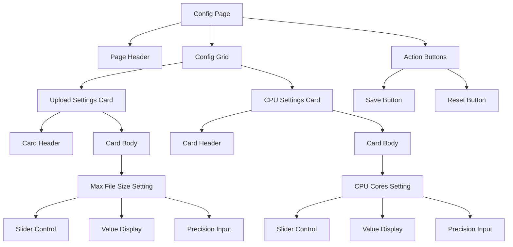

# Config Page Redesign - Card-Based Layout

## Overview
Transform the current vertically-stacked config page into a cleaner, more organized card-based grid layout.

## Current State
- Single column layout with nested containers
- Heavy use of borders and shadows
- Settings stacked vertically with dividers
- Dual input method (slider + number input) for each setting

## Proposed Design

### Layout Structure
```
┌─────────────────────────────────────────────────────────┐
│              SYSTEM CONFIGURATION                        │
│                    (Page Header)                         │
└─────────────────────────────────────────────────────────┘

┌──────────────────────┬──────────────────────┐
│   UPLOAD SETTINGS    │     CPU SETTINGS     │
│  ┌────────────────┐  │  ┌────────────────┐  │
│  │ Max File Size  │  │  │ CPU Cores      │  │
│  │ [slider]       │  │  │ [slider]       │  │
│  │ [input]  MB    │  │  │ [input] cores  │  │
│  └────────────────┘  │  └────────────────┘  │
└──────────────────────┴──────────────────────┘

                    [ SAVE ]  [ RESET ]
```

### Card Design
Each setting will be contained in its own card with:
- **Card Header**: Setting category (e.g., "UPLOAD SETTINGS", "CPU SETTINGS")
- **Card Body**: 
  - Label for the setting
  - Slider control with value display
  - Optional: Direct input field for precise values
- **Visual Style**: 
  - Clean borders with subtle glow
  - Consistent padding and spacing
  - Color-coded by category (cyan for upload, yellow for CPU)

### Grid Layout
- **Desktop (≥768px)**: 2-column grid
- **Tablet (≥576px)**: 2-column grid with smaller cards
- **Mobile (<576px)**: Single column, stacked cards

## Implementation Plan

### 1. HTML Structure Changes
```html
<div class="config-grid">
  <!-- Upload Settings Card -->
  <div class="config-card upload-card">
    <div class="config-card-header">
      <span class="card-icon">📤</span>
      <h3>Upload Settings</h3>
    </div>
    <div class="config-card-body">
      <div class="config-setting">
        <label>Max File Size</label>
        <div class="control-group">
          <input type="range" ...>
          <span class="value-display">512 MB</span>
        </div>
        <input type="number" class="precision-input" ...>
      </div>
    </div>
  </div>

  <!-- CPU Settings Card -->
  <div class="config-card cpu-card">
    <div class="config-card-header">
      <span class="card-icon">⚡</span>
      <h3>CPU Settings</h3>
    </div>
    <div class="config-card-body">
      <div class="config-setting">
        <label>CPU Cores</label>
        <div class="control-group">
          <input type="range" ...>
          <span class="value-display">2 cores</span>
        </div>
        <input type="number" class="precision-input" ...>
      </div>
    </div>
  </div>
</div>
```

### 2. CSS Changes
- Create `.config-grid` with CSS Grid layout
- Create `.config-card` with card styling
- Style card headers with category colors
- Style control groups for consistent alignment
- Add responsive breakpoints for mobile

### 3. JavaScript Changes
- No major changes needed
- Existing slider/input sync logic will work
- May need to update selectors if IDs change

## Visual Design Tokens

### Colors by Category
| Category | Border | Text | Glow |
|----------|--------|------|------|
| Upload | `--cyan-dim` | `--cyan` | `rgba(125, 216, 216, 0.2)` |
| CPU | `--yellow` | `--yellow` | `rgba(212, 200, 122, 0.2)` |

### Spacing
- Card gap: `var(--space-lg)` (1.5rem)
- Card padding: `var(--space-md)` (1rem)
- Setting margin: `var(--space-md)` (1rem)

### Typography
- Card title: `var(--font-display)`, `var(--text-sm)`, uppercase
- Setting label: `var(--font-body)`, `var(--text-sm)`
- Value display: `var(--font-display)`, `var(--text-xs)`

## Mermaid Diagram



## Benefits
1. **Better Organization**: Settings grouped by category in distinct cards
2. **Improved Scannability**: Visual separation makes it easier to find settings
3. **Responsive**: Grid adapts to different screen sizes
4. **Extensible**: Easy to add more settings/cards in the future
5. **Cleaner Visual Hierarchy**: Clear distinction between categories and settings
