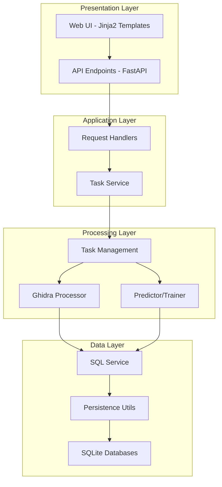
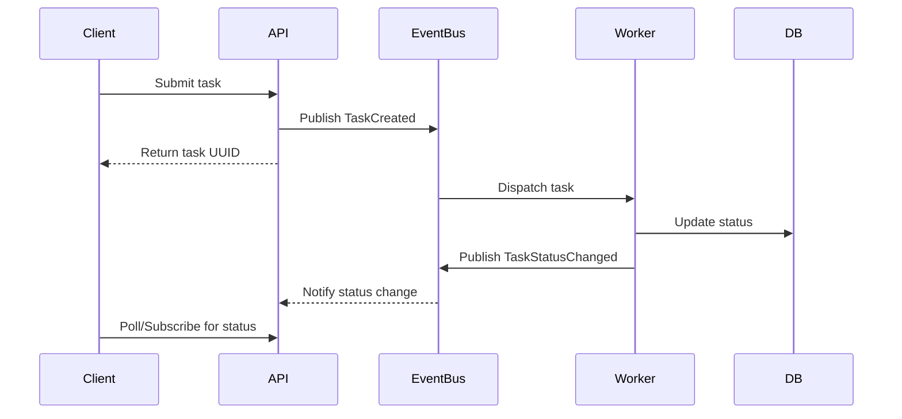

# Glyph - High-Level Design Recommendations

## Project Overview

Glyph is an architecture-independent binary analysis tool that uses NLP techniques for function fingerprinting across different system architectures. The application is built with FastAPI, uses SQLite for persistence, and integrates with Ghidra for binary decompilation.

## Current Architecture Summary



## Design Recommendations

### 1. API Versioning Strategy

**Current State:**
- API routes are under `/app/api/v1/endpoints/`
- Version is hardcoded in the directory structure

**Recommendation:**
Implement explicit API versioning in the URL path with a versioning middleware. This allows for:
- Multiple API versions to coexist
- Clear deprecation paths
- Better API documentation per version

**Suggested Structure:**
```
/api/v1/binaries
/api/v1/predictions
/api/v1/models
/api/v2/binaries  (future)
```

### 2. Separate API and Web Concerns

**Current State:**
- Web endpoints (`/app/web/endpoints/web.py`) and API endpoints are mixed
- Both use the same router registration pattern in `main.py`
- Template responses are mixed with JSON responses based on Accept headers

**Recommendation:**
Create a clear separation between:
- **API Router**: Pure JSON responses, OpenAPI documentation, versioned
- **Web Router**: HTML responses, session management, static file serving

This separation allows:
- Independent evolution of API and UI
- Clearer documentation (OpenAPI only for API)
- Easier testing (API tests don't need template context)

### 3. Configuration Management Enhancement

**Current State:**
- Configuration loaded from `config.yml` into a static dictionary
- `GlyphConfig` class uses static methods and class variables
- No validation or type safety for configuration values

**Recommendation:**
Use Pydantic Settings for configuration management:

```python
# Suggested approach
class GlyphSettings(BaseSettings):
    ghidra_location: Path
    ghidra_project_location: Path
    ghidra_project_name: str
    prediction_probability_threshold: float = Field(ge=0, le=100)
    max_file_size_mb: int = Field(ge=1, le=2048)
    cpu_cores: int = Field(ge=1, le=32)
    
    class Config:
        env_file = "config.yml"
        env_file_encoding = "utf-8"
```

Benefits:
- Type-safe configuration access
- Automatic validation
- Environment variable overrides
- Clear schema documentation

### 4. Database Abstraction Layer

**Current State:**
- Direct SQLite usage in `SQLUtil` class
- Two separate databases: `models.db` and `predictions.db`
- Raw SQL queries scattered throughout the codebase

**Recommendation:**
Implement a proper ORM or data access layer:

**Option A - SQLAlchemy ORM:**
- Already in dependencies
- Provides models, sessions, and query interface
- Easier migration to other databases

**Option B - Repository Pattern:**
```
app/database/
├── models/          # Data models
├── repositories/    # Data access repositories
├── sessions.py      # Database session management
└── sql_service.py   # Legacy compatibility
```

Benefits:
- Centralized data access logic
- Easier testing with mock repositories
- Database-agnostic design
- Better query organization

### 5. Event-Driven Task Architecture

**Current State:**
- `TaskService` uses a simple queue with background thread
- `TaskManager` uses `ProcessPoolExecutor` for parallel processing
- Status checking is done via direct database queries

**Recommendation:**
Implement an event-driven architecture:



Benefits:
- Decoupled task submission and processing
- Easier to add new task types
- Better scalability with multiple workers
- Real-time status updates possible with WebSockets

### 6. Model Management Improvements

**Current State:**
- Models stored as BLOBs in SQLite
- Model training and prediction share similar code paths
- No model versioning or metadata tracking

**Recommendation:**
Create a dedicated Model Registry:

```python
# Suggested model metadata structure
class ModelRegistry:
    - model_name: str
    - version: str
    - created_at: datetime
    - trained_on: list[BinaryInfo]
    - accuracy_metrics: dict
    - model_file_path: Path
    - label_encoder_file_path: Path
```

Benefits:
- Track model lineage and training data
- Support model versioning and rollback
- Better model comparison and selection
- Easier model lifecycle management

### 7. Unified Response Format

**Current State:**
- Responses vary between endpoints
- Some return nested objects, others flat dictionaries
- Error responses are inconsistent

**Recommendation:**
Standardize response format across all endpoints:

```python
# Success response
{
    "success": true,
    "data": { ... },
    "metadata": {
        "timestamp": "2024-01-01T00:00:00Z",
        "request_id": "uuid"
    }
}

# Error response
{
    "success": false,
    "error": {
        "code": "VALIDATION_ERROR",
        "message": "Human readable message",
        "details": { ... }
    }
}
```

Benefits:
- Consistent client-side handling
- Better API documentation
- Easier error tracking

### 8. Template Componentization

**Current State:**
- Templates are monolithic HTML files
- Repeated UI components duplicated across templates
- CSS files are separate but not modular

**Recommendation:**
Break down templates into reusable components:

```
templates/
├── components/
│   ├── header.html
│   ├── footer.html
│   ├── navigation.html
│   ├── function_table.html
│   └── prediction_card.html
├── layouts/
│   └── base.html
└── pages/
    ├── main.html
    ├── upload.html
    └── ...
```

Benefits:
- DRY principle for UI
- Easier theme changes
- Consistent UI across pages

**Implementation Status:**

The following components have been created:

| Component | File | Description |
|-----------|------|-------------|
| Navbar | `templates/components/navbar.html` | Navigation bar with logo and links |
| Background | `templates/components/background.html` | Visual effects (stars, grid, particles) |
| Scripts | `templates/components/scripts.html` | Common JavaScript includes |
| Model Table | `templates/components/model_table.html` | Displays model list with status |
| Function Table | `templates/components/function_table.html` | Generic table for functions/predictions |
| Token Display | `templates/components/token_display.html` | Displays tokenized function code |
| Page Header | `templates/components/page_header.html` | Metadata display (task/model/function names) |
| Button Group | `templates/components/button_group.html` | Common action buttons pattern |
| Empty State | `templates/components/empty_state.html` | No-data message with icon |
| Common JS | `static/js/common.js` | Shared JavaScript utilities |

**Updated Templates:**
- [`templates/get_models.html`](templates/get_models.html) - Uses `model_table.html` and `empty_state.html`
- [`templates/get_function.html`](templates/get_function.html) - Uses `token_display.html` and `button_group.html`
- [`templates/get_symbols.html`](templates/get_symbols.html) - Uses `page_header.html` and `button_group.html`
- [`templates/get_predictions.html`](templates/get_predictions.html) - Uses `button_group.html`
- [`templates/get_prediction.html`](templates/get_prediction.html) - Uses `page_header.html` and `button_group.html`
- [`templates/prediction_function_details.html`](templates/prediction_function_details.html) - Uses `page_header.html` and `button_group.html`

**Remaining Work:**
- Create `footer.html` component if needed
- Create `prediction_card.html` for card-style prediction display
- Consider creating `upload_form.html` component for the upload page
- Create `config_section.html` for reusable configuration form sections
- Move page-specific JavaScript to separate files in `static/js/`

### 9. Processing Pipeline Abstraction

**Current State:**
- `GhidraProcessor` and `TaskManagement` are tightly coupled
- Processing steps are hardcoded in methods
- No clear pipeline definition

**Recommendation:**
Implement a pipeline pattern for binary processing:


Each step as a pluggable processor:

```python
class ProcessingPipeline:
    def __init__(self):
        self.steps = [
            ValidationStep(),
            DecompileStep(),
            TokenizeStep(),
            FilterStep(),
            FeatureExtractStep(),
        ]
    
    def process(self, binary):
        result = binary
        for step in self.steps:
            result = step.process(result)
        return result
```

Benefits:
- Easy to add/modify processing steps
- Clear separation of concerns
- Easier testing of individual steps
- Reusable processing logic

### 10. Documentation Structure

**Current State:**
- README has basic information
- API documentation via FastAPI Swagger
- No architecture documentation

**Recommendation:**
Create comprehensive documentation:

```
docs/
├── architecture/
│   ├── overview.md
│   ├── data-flow.md
│   └── component-diagrams.md
├── api/
│   ├── getting-started.md
│   ├── endpoints.md
│   └── examples.md
├── development/
│   ├── setup.md
│   ├── contributing.md
│   └── testing.md
└── user-guide/
    ├── quickstart.md
    ├── binary-upload.md
    ├── model-training.md
    └── predictions.md
```

## Priority Recommendations

### High Priority
1. **Configuration Management** - Pydantic settings provide immediate type safety and validation benefits
2. **Unified Response Format** - Improves API consistency with minimal refactoring
3. **Template Componentization** - Reduces UI code duplication

### Medium Priority
4. **Database Abstraction Layer** - Enables future database flexibility
5. **Processing Pipeline Abstraction** - Improves code organization and testability
6. **API/Web Separation** - Clarifies application boundaries

### Lower Priority
7. **Event-Driven Architecture** - Significant refactoring, best for major version update
8. **Model Registry** - Valuable for production use with multiple models
9. **Documentation Structure** - Ongoing improvement

## Conclusion

These recommendations focus on improving the high-level design of Glyph without addressing security, performance, or robustness concerns. Implementing these changes will result in a more maintainable, extensible, and well-organized codebase that can better support future feature development.
