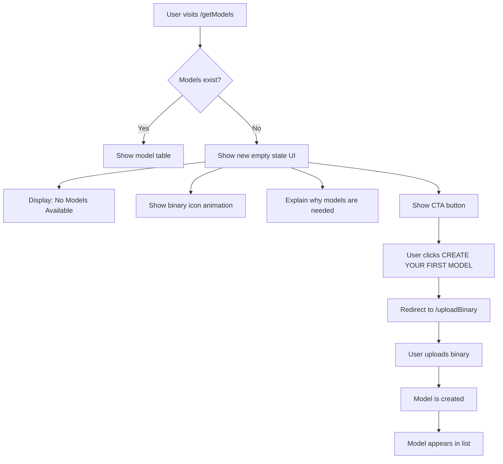

# Plan: New Empty State UI for "No Models" Page

## Overview

Replace the current simple message-balloon empty state on the models page with a more engaging, informative, and action-oriented UI that clearly tells the user they need to create a model first, with a direct call-to-action button to navigate to the upload page.

## Current State

When no models exist, [`get_models.html`](templates/get_models.html:13) renders the existing [`empty_state.html`](templates/components/empty_state.html:1) component with:
- A simple speech balloon message: "Uh oh! it looks like no models have been generated! Try going to upload to start!"
- An animated cyber-octocat icon
- No direct action button (user must navigate manually)

## Proposed Design

### Visual Layout

```
┌─────────────────────────────────────────────────────────┐
│  [Corner Bracket]                              [Bracket] │
│                                                         │
│              // NO MODELS AVAILABLE //                   │
│                                                         │
│    ┌─────────────────────────────────────────────┐      │
│    │                                             │      │
│    │         [Pixel Art Icon - Binary]           │      │
│    │                                             │      │
│    │    No models have been created yet.         │      │
│    │                                             │      │
│    │    Models are required for binary analysis  │      │
│    │    and prediction tasks.                    │      │
│    │                                             │      │
│    └─────────────────────────────────────────────┘      │
│                                                         │
│               [ CREATE YOUR FIRST MODEL ]                │
│                                                         │
│          Upload a binary to get started                  │
│                                                         │
│  [Corner Bracket]                              [Bracket] │
└─────────────────────────────────────────────────────────┘
```

### Key Features

1. **Clear Heading** - "// NO MODELS AVAILABLE //" in the cyberpunk display font
2. **Illustrative Icon** - A CSS-based pixel art icon (binary/code themed) with a subtle pulse animation
3. **Informative Message** - Explains what models are and why they're needed
4. **Primary CTA Button** - Direct link to `/uploadBinary` page with "CREATE YOUR FIRST MODEL" label
5. **Secondary Hint** - "Upload a binary to get started" with blinking animation
6. **Cyberpunk Card Container** - Matches the existing card design with corner brackets and glow effects

## Implementation Steps

### Step 1: Create New Empty State Component

**File:** `templates/components/no_models_empty_state.html` (new file)

Create a dedicated empty state component specifically for the "no models" scenario:

```html
{# No Models Empty State Component
# Displays when no models exist, guiding user to create one
# Usage:
#   
#}
<div class="no-models-empty-state">
    <div class="empty-state-card">
        <div class="empty-state-header">
            <h2 class="empty-state-title">// NO MODELS AVAILABLE //</h2>
        </div>
        
        <div class="empty-state-icon-wrapper">
            <div class="binary-icon" aria-hidden="true">
                <span class="bit">0</span><span class="bit">1</span>
                <span class="bit">1</span><span class="bit">0</span>
                <span class="bit">0</span><span class="bit">1</span>
                <span class="bit">1</span><span class="bit">0</span>
            </div>
        </div>
        
        <div class="empty-state-message">
            <p class="empty-state-description">
                No models have been created yet.
            </p>
            <p class="empty-state-description">
                Models are required for binary analysis<br>
                and prediction tasks.
            </p>
        </div>
        
        <div class="empty-state-actions">
            <a href="{{ url_for('static', path='') }}/uploadBinary" 
               class="cyber-btn is-primary empty-state-cta"
               role="button"
               aria-label="Create your first model">
                [ CREATE YOUR FIRST MODEL ]
            </a>
            <p class="empty-state-hint blink_text">
                Upload a binary to get started
            </p>
        </div>
    </div>
</div>
```

### Step 2: Add CSS Styles

**File:** [`static/css/models_style.css`](static/css/models_style.css:1) - Append new styles

Add the following CSS styles at the end of the file:

```css
/* =============================================================
   No Models Empty State
   ============================================================= */

.no-models-empty-state {
    display: flex;
    align-items: center;
    justify-content: center;
    width: 100%;
    min-height: 400px;
    padding: var(--space-xl) var(--space-md);
}

.empty-state-card {
    background: var(--bg-panel) !important;
    border: 2px solid var(--cyan-dim) !important;
    box-shadow:
        0 0 20px rgba(125, 216, 216, 0.12),
        0 0 60px rgba(125, 216, 216, 0.05),
        inset 0 0 24px rgba(125, 216, 216, 0.03);
    max-width: 520px;
    width: 100%;
    padding: var(--space-2xl) var(--space-xl);
    position: relative;
    text-align: center;
}

/* Corner brackets */
.empty-state-card::before,
.empty-state-card::after {
    content: '';
    position: absolute;
    width: 14px;
    height: 14px;
    border-color: var(--magenta-dim);
    border-style: solid;
}

.empty-state-card::before {
    top: -2px;
    left: -2px;
    border-width: 2px 0 0 2px;
}

.empty-state-card::after {
    bottom: -2px;
    right: -2px;
    border-width: 0 2px 2px 0;
}

.empty-state-title {
    font-family: var(--font-display);
    font-size: var(--text-sm);
    letter-spacing: 0.08em;
    color: var(--cyan-bright);
    text-shadow:
        0 0 10px rgba(168, 236, 236, 0.30),
        2px 2px 0 var(--magenta-dim);
    margin: 0 0 var(--space-xl) 0;
    padding-bottom: var(--space-md);
    border-bottom: 1px solid var(--cyan-dim);
}

/* Binary icon animation */
.empty-state-icon-wrapper {
    margin: var(--space-lg) auto;
    height: 80px;
    display: flex;
    align-items: center;
    justify-content: center;
}

.binary-icon {
    display: grid;
    grid-template-columns: repeat(4, 1fr);
    grid-template-rows: repeat(2, 1fr);
    gap: 4px;
    padding: var(--space-md);
    background: rgba(125, 216, 216, 0.05);
    border: 1px solid var(--cyan-dim);
}

.binary-icon .bit {
    font-family: var(--font-code);
    font-size: var(--text-lg);
    color: var(--cyan);
    text-shadow: 0 0 8px rgba(125, 216, 216, 0.4);
    animation: bit-flicker 3s ease-in-out infinite;
}

.binary-icon .bit:nth-child(odd) {
    animation-delay: 0.5s;
    color: var(--magenta);
    text-shadow: 0 0 8px rgba(200, 122, 184, 0.4);
}

@keyframes bit-flicker {
    0%, 100% { opacity: 1; }
    50% { opacity: 0.4; }
}

.empty-state-message {
    margin: var(--space-lg) 0;
}

.empty-state-description {
    font-family: var(--font-body);
    font-size: var(--text-sm);
    line-height: var(--leading-relaxed);
    color: var(--text-dim);
    letter-spacing: 0.04em;
    margin: var(--space-xs) 0;
}

.empty-state-actions {
    margin-top: var(--space-xl);
}

.empty-state-cta {
    font-size: var(--text-sm);
    padding: var(--btn-padding-y-lg) var(--btn-padding-x-lg);
    min-height: var(--btn-min-height);
    display: inline-block;
    animation: cta-pulse 2s ease-in-out infinite;
}

@keyframes cta-pulse {
    0%, 100% {
        box-shadow: 0 0 10px rgba(212, 200, 122, 0.2);
    }
    50% {
        box-shadow: 0 0 20px rgba(212, 200, 122, 0.4);
    }
}

.empty-state-hint {
    font-family: var(--font-display);
    color: var(--text-muted);
    font-size: var(--text-xs) !important;
    margin-top: var(--space-md) !important;
    letter-spacing: 0.06em;
}

/* Responsive adjustments */
@media (max-width: var(--breakpoint-sm)) {
    .empty-state-card {
        padding: var(--space-xl) var(--space-md);
    }
    
    .empty-state-title {
        font-size: var(--text-xs);
    }
    
    .binary-icon .bit {
        font-size: var(--text-sm);
    }
}
```

### Step 3: Update Models Page Template

**File:** [`templates/get_models.html`](templates/get_models.html:13)

Replace the current empty state block (lines 13-18):

**Before:**
```jinja2







```

**After:**
```jinja2



```

Also remove the "Delete Selected" button when no models exist, as it is not applicable:

**Before:**
```jinja2
<div class="btn-group" style="margin-top: 1.5rem;">
    <button type="button" id="delete-selected-btn" class="cyber-btn is-danger delete-selected-btn" disabled aria-label="Delete selected models">Delete Selected</button>
    <button type="button" class="cyber-btn is-primary back-btn" aria-label="Go back">Go Back</button>
</div>
```

**After:**
```jinja2

<div class="btn-group" style="margin-top: 1.5rem;">
    <button type="button" id="delete-selected-btn" class="cyber-btn is-danger delete-selected-btn" disabled aria-label="Delete selected models">Delete Selected</button>
    <button type="button" class="cyber-btn is-primary back-btn" aria-label="Go back">Go Back</button>
</div>

```

## File Summary

| File | Action | Description |
|------|--------|-------------|
| `templates/components/no_models_empty_state.html` | **Create** | New dedicated empty state component |
| [`static/css/models_style.css`](static/css/models_style.css:1) | **Modify** | Append empty state CSS styles |
| [`templates/get_models.html`](templates/get_models.html:1) | **Modify** | Replace empty state include and conditionally show button group |

## Design Rationale

1. **Consistent Theme** - Uses the existing cyberpunk design language (corner brackets, glow effects, pixel fonts, color palette)
2. **Clear Action** - Primary CTA button directly links to the upload page, reducing friction
3. **Informative** - Explains *why* models are needed, not just that they're missing
4. **Engaging** - Animated binary icon and pulsing CTA draw attention without being distracting
5. **Accessible** - Proper ARIA labels, semantic HTML, and keyboard-navigable button
6. **Responsive** - Adapts to smaller screens with adjusted padding and font sizes

## Mermaid Diagram


