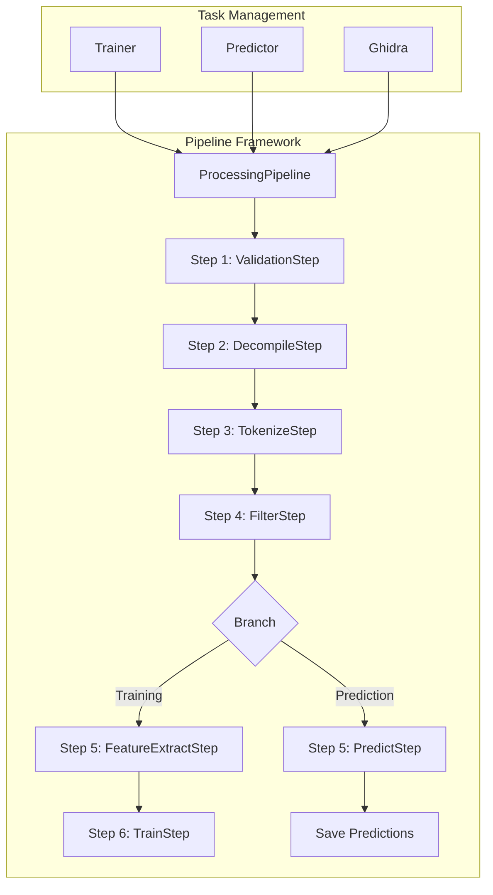

# Pipeline Refactoring Plan

## Overview

This plan outlines the refactoring of Glyph's processing layer to implement the pluggable pipeline architecture described in `docs/ARCHITECTURE.md`. Currently, the pipeline files (`pipeline.py` and `steps.py`) are documented but do not exist. Processing logic is scattered across `task_management.py`, `ghidra_processor.py`, and `request_handler.py`.

## Current State Analysis

### Existing Processing Flow

**Training Pipeline (Current):**
1. Binary uploaded via [`binaries.py`](app/api/v1/endpoints/binaries.py:188)
2. [`GhidraRequest`](app/services/request_handler.py:130) created
3. [`Ghidra.start_task()`](app/processing/task_management.py:553) submits to ProcessPoolExecutor
4. [`Ghidra._run_analysis()`](app/processing/task_management.py:580) calls [`ghidra_processor.analyze_binary_and_decompile()`](app/processing/ghidra_processor.py:202)
5. On completion, [`Trainer.start_training()`](app/processing/task_management.py:344) is triggered
6. [`Trainer._train_model()`](app/processing/task_management.py:364) uses sklearn Pipeline directly

**Prediction Pipeline (Current):**
1. Binary uploaded via [`binaries.py`](app/api/v1/endpoints/binaries.py:188)
2. [`GhidraRequest`](app/services/request_handler.py:130) created
3. [`Ghidra.start_task()`](app/processing/task_management.py:553) submits to ProcessPoolExecutor
4. [`Ghidra._run_analysis()`](app/processing/task_management.py:580) calls [`ghidra_processor.analyze_binary_and_decompile()`](app/processing/ghidra_processor.py:202)
5. Results processed directly without pipeline abstraction

### Current Processing Components

| File | Responsibilities |
|------|------------------|
| [`task_management.py`](app/processing/task_management.py:1) | Task execution, Trainer/Predictor/Ghidra classes, EventWatcher |
| [`ghidra_processor.py`](app/processing/ghidra_processor.py:1) | Ghidra integration, decompilation, tokenization, filtering |
| [`request_handler.py`](app/services/request_handler.py:1) | Request data structures (TrainingRequest, PredictionRequest, GhidraRequest) |
| [`persistence_util.py`](app/utils/persistence_util.py:1) | ML pipeline configuration, model persistence |

## Target Architecture

### Pipeline Pattern Design



### Pipeline Step Interface

Each step implements a common interface:

```python
class PipelineStep(ABC):
    """Abstract base class for pipeline steps."""
    
    @abstractmethod
    def execute(self, context: PipelineContext) -> PipelineContext:
        """Execute this step and return updated context."""
        pass
    
    @abstractmethod
    def get_name(self) -> str:
        """Return the name of this step."""
        pass
```

### Pipeline Context

The context carries data through the pipeline:

```python
@dataclass
class PipelineContext:
    """Context object carrying data through the pipeline."""
    uuid: str
    binary_path: str
    model_name: str
    is_training: bool
    task_name: str | None
    status: str
    functions: list[dict] | None
    tokens: list[str] | None
    features: Any | None
    error: str | None
```

## Implementation Plan

### Phase 1: Create Pipeline Framework

#### 1.1 Create `app/processing/pipeline.py`

**Responsibilities:**
- Define `PipelineStep` abstract base class
- Define `PipelineContext` data class
- Implement `ProcessingPipeline` class that orchestrates step execution
- Provide factory methods for training and prediction pipelines

**Key Methods:**
```python
class ProcessingPipeline:
    def __init__(self, steps: list[PipelineStep])
    def execute(self, context: PipelineContext) -> PipelineContext
    @staticmethod
    def create_training_pipeline() -> ProcessingPipeline
    @staticmethod
    def create_prediction_pipeline() -> ProcessingPipeline
```

#### 1.2 Create `app/processing/steps.py`

**Step Classes to Implement:**

| Step | Purpose | Input | Output |
|------|---------|-------|--------|
| `ValidationStep` | Validate binary file exists and is readable | binary_path | validated_path |
| `DecompileStep` | Run Ghidra decompilation | binary_path | functions list |
| `TokenizeStep` | Extract tokens from decompiled code | functions | tokenized functions |
| `FilterStep` | Filter/normalize tokens | tokenized functions | filtered functions |
| `FeatureExtractStep` | Convert tokens to feature vectors | filtered functions | feature vectors |
| `TrainStep` | Train ML model | feature vectors | trained model |
| `PredictStep` | Run predictions | feature vectors, model | predictions |

### Phase 2: Refactor Existing Code

#### 2.1 Refactor `ghidra_processor.py`

**Changes:**
- Move `filter_tokens()` to `FilterStep`
- Move tokenization logic to `TokenizeStep`
- Keep `analyze_binary_and_decompile()` as a utility used by `DecompileStep`
- Keep Ghidra-specific utilities (`setup_decompiler`, `get_function_tokens`, etc.)

#### 2.2 Refactor `task_management.py`

**Changes:**
- `Trainer` class: Use `ProcessingPipeline.create_training_pipeline()`
- `Predictor` class: Use `ProcessingPipeline.create_prediction_pipeline()`
- `Ghidra` class: Integrate with pipeline or remain as Ghidra-specific orchestrator
- Keep `EventWatcher` and `TaskManager` base class unchanged

#### 2.3 Refactor `request_handler.py`

**Changes:**
- Keep `GhidraRequest` as-is (used for API layer)
- Update `TrainingRequest` and `PredictionRequest` to work with `PipelineContext`
- Consider merging request handlers with pipeline context

#### 2.4 Update `persistence_util.py`

**Changes:**
- Keep `MLTask` class as pipeline configuration provider
- Ensure `MLPersistanceUtil` works with `TrainStep` and `PredictStep`

### Phase 3: Testing

**Test Files to Create/Update:**
- `tests/test_pipeline.py` - Test `ProcessingPipeline` class
- `tests/test_steps.py` - Test individual pipeline steps
- Update `tests/test_task_management.py` - Test refactored task management

## Detailed Step Implementations

### ValidationStep

```python
class ValidationStep(PipelineStep):
    def execute(self, context: PipelineContext) -> PipelineContext:
        # Check file exists
        # Check file is readable
        # Check file size within limits
        # Validate MIME type
        return context
```

### DecompileStep

```python
class DecompileStep(PipelineStep):
    def execute(self, context: PipelineContext) -> PipelineContext:
        # Call ghidra_processor.analyze_binary_and_decompile()
        # Store functions in context
        return context
```

### TokenizeStep

```python
class TokenizeStep(PipelineStep):
    def execute(self, context: PipelineContext) -> PipelineContext:
        # Extract tokenList from each function
        # Join tokens into string
        # Store in context
        return context
```

### FilterStep

```python
class FilterStep(PipelineStep):
    def execute(self, context: PipelineContext) -> PipelineContext:
        # Apply filter_tokens() logic
        # Normalize addresses, functions, variables
        # Remove comments
        return context
```

### FeatureExtractStep

```python
class FeatureExtractStep(PipelineStep):
    def execute(self, context: PipelineContext) -> PipelineContext:
        # Use TfidfVectorizer to extract features
        # Store features in context
        return context
```

### TrainStep

```python
class TrainStep(PipelineStep):
    def execute(self, context: PipelineContext) -> PipelineContext:
        # Get ML pipeline from MLTask
        # Train model
        # Save model via MLPersistanceUtil
        return context
```

### PredictStep

```python
class PredictStep(PipelineStep):
    def execute(self, context: PipelineContext) -> PipelineContext:
        # Load model via MLPersistanceUtil
        # Run predictions
        # Apply probability threshold
        # Store predictions in context
        return context
```

## Migration Strategy

### Step-by-Step Migration

1. **Create new files first** - `pipeline.py` and `steps.py` without breaking existing code
2. **Implement steps incrementally** - Start with `ValidationStep` and `DecompileStep`
3. **Update task management** - Refactor `Trainer` and `Predictor` to use pipeline
4. **Extract logic from ghidra_processor** - Move tokenization/filtering to steps
5. **Add tests** - Ensure each step is tested independently
6. **Remove duplicate code** - Clean up any remaining duplication

### Backward Compatibility

- Keep existing API endpoints unchanged
- Maintain existing request/response formats
- Ensure `EventWatcher` continues to work with refactored code

## Benefits of Refactoring

1. **Separation of Concerns** - Each step has a single responsibility
2. **Testability** - Steps can be tested independently
3. **Extensibility** - New steps can be added without modifying existing code
4. **Reusability** - Steps can be reused across different pipelines
5. **Maintainability** - Clear structure makes code easier to understand and modify

## Risks and Mitigations

| Risk | Mitigation |
|------|------------|
| Breaking existing functionality | Comprehensive testing before deployment |
| Performance regression | Benchmark before and after refactoring |
| Complexity increase | Keep step implementations simple and focused |
| Integration issues | Incremental migration with frequent integration tests |

## Success Criteria

1. All existing tests pass
2. New pipeline tests added and passing
3. Training pipeline produces same results as before
4. Prediction pipeline produces same results as before
5. Code coverage maintained or improved
6. Documentation updated to reflect new architecture
